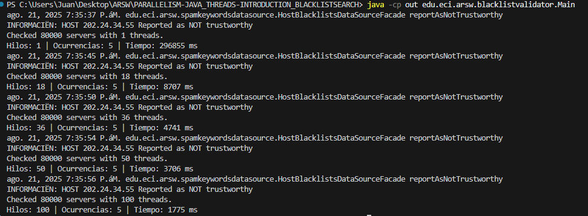
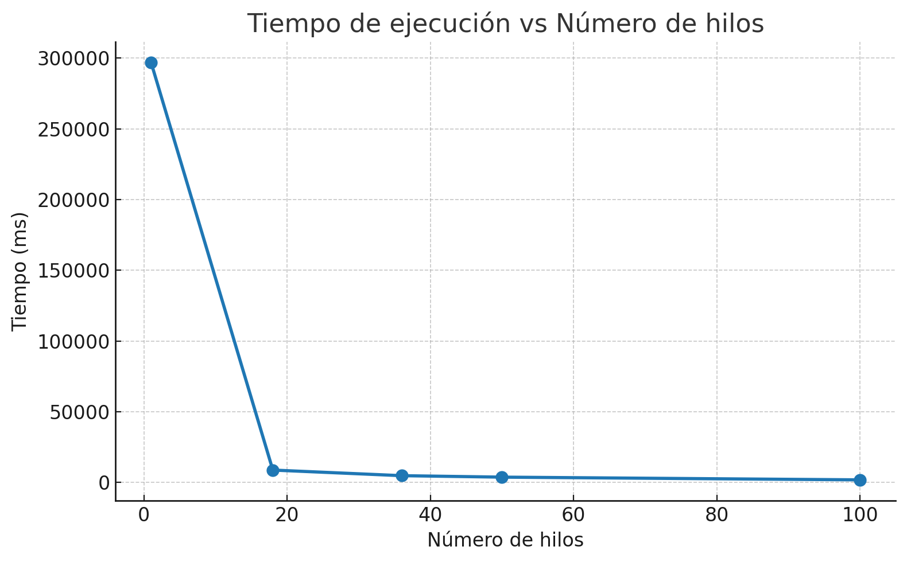

## Paralelismo - Hilos - Caso BlackListSearch
### Descripción

Este laboratorio introduce los conceptos básicos de paralelismo en Java mediante hilos (threads).
Se trabaja con ejemplos sencillos para comprender el ciclo de vida de un hilo y luego se aplica al caso de estudio BlackListSearch, donde se valida una dirección IP contra miles de listas negras de hosts maliciosos.

El objetivo es entender cómo explotar la capacidad multi-núcleo de un procesador para mejorar el desempeño de un sistema de búsqueda que puede ejecutarse en paralelo.

### Diagrama de clase


### Solucion

**Parte I - Introducción a Hilos en Java**

1. Si corremos con Start ocurre lo siguiente
 
2. Si corremos con Run ocurre lo siguiente

3. Lo primero que observamos es que al usar start() la salida aparece en desorden, mientras que con run() se mantiene en orden. Esto ocurre porque con start() realmente se crean y ejecutan hilos en paralelo, lo que implica que cada hilo puede terminar y mostrar resultados en momentos diferentes, produciendo un orden de salida no determinístico.
En cambio, al invocar directamente run(), no se crea un hilo independiente, sino que el método se ejecuta de manera secuencial dentro del hilo principal, por lo que los números se imprimen en el orden esperado.

**Parte II - Ejercicio Black List Search**

1. En esta prueba se usaron 5 hilos para realizar la prueba 


**Parte III - Evaluación de Desempeño**

1. Asi es como se ve en la terminal una vez corre todo, se demora 5 min Aprox, debido a que estamos corriendo una lista de 80.000 con un solo hilo, asi que por eso se demora bastante, tambien cabe aclarar que mientras corre un 1 hilo, corre tambien los 18 (de mi procesador), los 36 (el doble de mi procesador), 50 y los 100

2. Asi es como se ve en jVisualVM


3. A continuacion una explicacion con grafica

**Análisis**
    * El uso de múltiples hilos mejora el desempeño porque, mientras algunos hilos están bloqueados en espera (simulando la latencia de acceso a servidores), otros hilos pueden avanzar en consultas.
    * El CPU no se incrementa significativamente (como se observó en JVisualVM), ya que la mayor parte del tiempo los hilos no realizan cómputo intensivo
**Hipótesis**
    * Si el número de hilos sigue aumentando, la mejora en tiempo tenderá a estabilizarse, porque llegará un punto en el que el overhead de crear/gestionar más hilos será mayor que el beneficio.
    * En un escenario real con cómputo intensivo, sí se observaría un mayor consumo de CPU en JVisualVM al aumentar el número de hilos, ya que habría competencia directa por los núcleos.

**Parte IV - Ejercicio Black List Search**
La ley de Amdahl dice que mientras más partes de un programa se puedan paralelizar (ejecutar en varios hilos a la vez), más rápido debería correr. Pero en la práctica no pasa que entre más hilos siempre sea mejor, porque:

1. Cuando se crean demasiados hilos, el computador gasta tiempo organizándolos y turnándolos para que usen el procesador. Por eso, con 200 hilos puede ser más eficiente que con 500.
2. Cuando el número de hilos coincide con los núcleos del procesador, cada hilo tiene su propio “espacio” para trabajar y se aprovecha mejor. Si pones el doble, los hilos tienen que turnarse en el mismo núcleo y terminan estorbándose, así que no mejora tanto el tiempo (y hasta puede empeorar).
3. Si en vez de 100 hilos en una sola computadora (que se están peleando por pocos núcleos), repartes 1 hilo en 100 máquinas distintas, cada máquina trabaja sin estorbarse. Así la ley de Amdahl se cumpliría mejor, porque realmente estás paralelizando de manera más “real” y sin tanta coordinación extra.
4. Si se reparte el trabajo en varias máquinas, cada una con la cantidad justa de hilos para sus núcleos, el sistema puede balancearse mejor y aprovechar los recursos. Pero también depende de que la comunicación entre máquinas no sea más lenta que el beneficio de repartir la carga.

## Compilar y Ejecutar


1. La estructura de este laboratorio es la siguiente 
```plaintext
paralelismo---Hilos---Caso-BlackListSearch/
 └── src/
     └── main/
         └── java/
             └── edu/
                 └── eci/
                     └── arsw/
                         └── threads/
                             └── CountThreadsMain.java
```

# Punto 1

1. Ubicarse en la carpeta raíz del proyecto (paralelismo---Hilos---Caso-BlackListSearch) y ejecutar ():
    * javac -d out src/main/java/edu/eci/arsw/threads/*.java src/main/java/edu/eci/arsw/spamkeywordsdatasource/*.java
    * *-d out indica que los archivos .class compilados se guardarán en la carpeta out
2. Una vez compilado, se ejecuta con:
    *java -cp out edu.eci.arsw.threads.CountThreadsMain
    *-cp out especifica el classpath (ruta donde se encuentran las clases compiladas).

# punto 2

1. Ubicarse en la carpeta raíz del proyecto (paralelismo---Hilos---Caso-BlackListSearch) y ejecutar :
    * javac -d out -cp out src/main/java/edu/eci/arsw/blacklistvalidator/HostBlackListsValidator.java
2. Una vez compilado, se ejecuta con:
    * java -cp out edu.eci.arsw.blacklistvalidator.Main


## Autor

    Juan David Rodriguez Rodriguez
