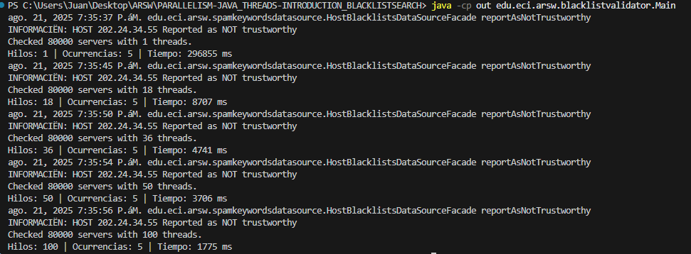
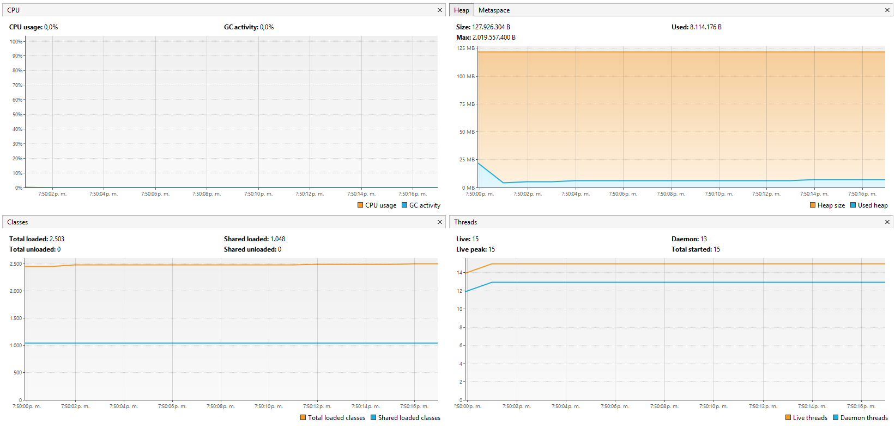
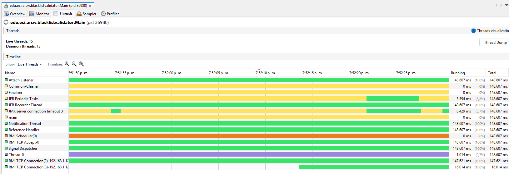
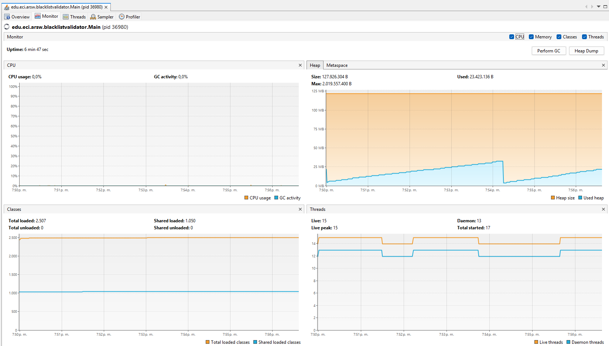
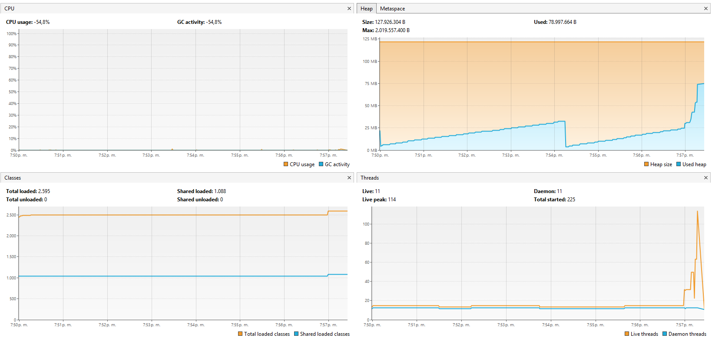
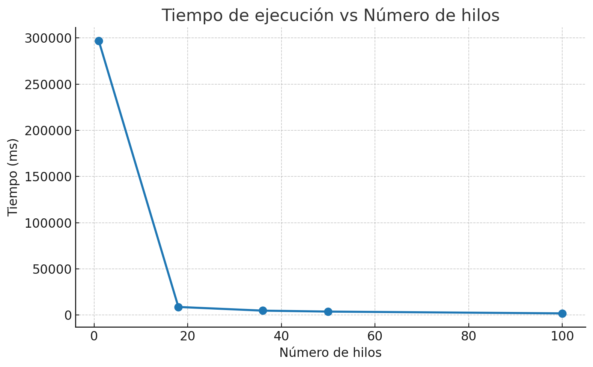

## Paralelismo - Hilos - Caso BlackListSearch

**Parte I - Introducción a Hilos en Java**
**Parte III - Evaluación de Desempeño**

1. Asi es como se ve en la terminal una vez corre todo, se demora 5 min Aprox, debido a que estamos corriendo una lista de 80.000 con un solo hilo, asi que por eso se demora bastante, tambien cabe aclarar que mientras corre un 1 hilo, corre tambien los 18 (de mi procesador), los 36 (el doble de mi procesador), 50 y los 100

2. Asi es como se ve en jVisualVM

3. A continuacion una explicacion con grafica

**Análisis**
    * El uso de múltiples hilos mejora el desempeño porque, mientras algunos hilos están bloqueados en espera (simulando la latencia de acceso a servidores), otros hilos pueden avanzar en consultas.
    * El CPU no se incrementa significativamente (como se observó en JVisualVM), ya que la mayor parte del tiempo los hilos no realizan cómputo intensivo
**Hipótesis**
    * Si el número de hilos sigue aumentando, la mejora en tiempo tenderá a estabilizarse, porque llegará un punto en el que el overhead de crear/gestionar más hilos será mayor que el beneficio.
    * En un escenario real con cómputo intensivo, sí se observaría un mayor consumo de CPU en JVisualVM al aumentar el número de hilos, ya que habría competencia directa por los núcleos.